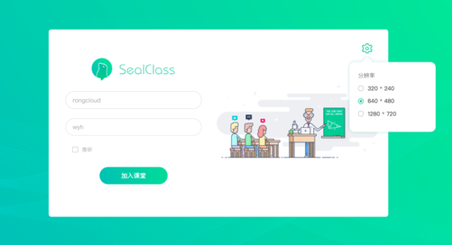

## 课堂页面

### 文件位置

`UI 模板`: pages/class/class.html

`逻辑操作:` pages/class/class.js

### 课堂布局

* [顶部课堂信息](./class/class-info.md)
* [最左侧共享展示区](./class/display.md)
* [右上方视频展示区](./class/rtc.md)
* [右下方聊天区](./class/chat.md)
* [右下方人员列表和操作区](./class/user-list.md)

> data

|  属性名      | 类型     | 说明     |
| :---------- | :------- | :------- |
| tabList | Array |  Tab 栏所有可选项, 目前为 课堂信息或在线人员 |
| selectedTab |  Object | 选中的 Tab |
| userList |  Array | 房间人员列表 |

> computed

|  属性名      | 类型     | 说明     |
| :---------- | :------- | :------- |
| loginUser | Object |  登录用户 |
| assistant |  Object | 助教 |
| teacher |  Object | 老师 |

> methods

#### hungup

退出课堂

`参数说明`

|  属性名      | 类型     | 说明     |
| :---------- | :------- | :------- |
| isJump | Boolean |  挂断后是否跳转至登录页面 |

#### toLoginPage

Vue 路由至登录页面

#### hungupWhenBeforeUnload

监听页面刷新或关闭, 页面关闭前, 先执行挂断方法退出房间

#### hungupWhenRTCError

当 RTC SDK 报错时, 退出房间

#### reconnectWhenNetworkUnavailable

网络不稳定时, 自动重连

#### hungupWhenClassKicked

被助教踢出房间时, 退出房间

#### toastWhenSelfRoleChanged

监听自己角色的变化, 当角色变化时, 弹框提示

#### toastWhenDeviceChanged

监听助教改变自己的资源, 当资源改变时, 弹框提示

#### toastMemberStatus

进入房间后, 如果房间内只有自己一人或自己身份为旁听者, 弹框提示