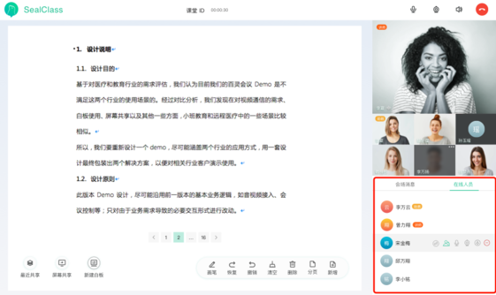

## 用户列表

### 文件位置

`UI 模板:` components/user-list/user-list.html

`逻辑操作:` components/user-list/user-list.js

### 子模块

`用户操作模块:` [user-opt](./user-opt.md)

> props

|  属性名      | 类型     | 说明     |
| :---------- | :------- | :------- |
| loginUser | Object |  登录用户 |
| userList |  Array | 房间人员列表 |

> data

|  属性名      | 类型     | 说明     |
| :---------- | :------- | :------- |
| isSpeechApplying | Boolean | 是否正在申请中 |

> computed

|  属性名      | 类型     | 说明     |
| :---------- | :------- | :------- |
| sortedUserList | Array | 根据角色排序后的用户列表 |

> methods

#### isShowRole

是否展示角色名(仅助教、讲师展示)

#### getRoleName

根据 user 获取角色名

#### watchApplySpeech

监听旁观者申请成为学员(仅当自己为助教时触发)

#### watchInviteUpgrade

监听助教邀请成为学院(仅当自己为旁观者时触发)

#### watchControlDevice

监听助教邀请打开麦克风/摄像头

#### approveSpeech

同意旁观者发言(仅当自己为助教时执行)

#### rejectSpeech

拒绝旁观者发言(仅当自己为助教时执行)

#### degradePerson

降级学员(仅当自己为助教时执行)

#### applyDegrade

降级学员弹框提示(仅当自己为助教时执行)

#### approveUpgrade

同意助教的升级邀请(仅当自己为旁观者时执行)

#### rejectUpgrade

拒绝助教的升级邀请(仅当自己为旁观者时执行)

#### approveControlDevice

同意助教打开自己的摄像头/麦克风(仅当自己为旁观者时执行)

#### rejectControlDevice

拒绝助教打开自己的摄像头/麦克风(仅当自己为旁观者时执行)